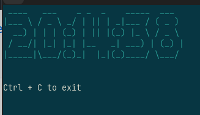

# Terminal_Clock
A ASCII art style Terminal Clock screen saver

## Install:

1. Clone Repo
`git clone github.com/Alottachairs/Terminal_Clock`

2. Install Python

3. Install modules:
`pip install pyfiglet`

4. run
`python main.py` or `python3 main.py`
